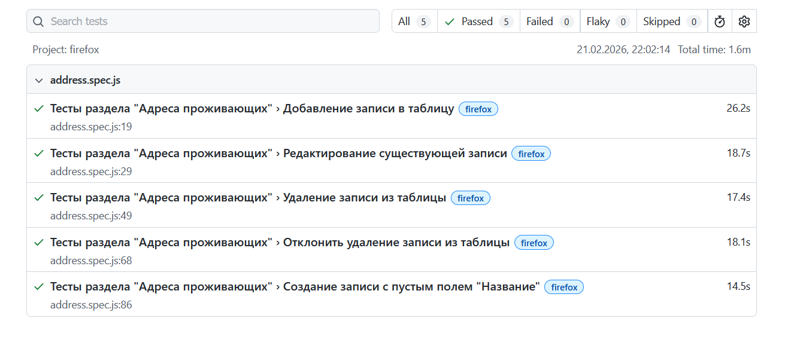
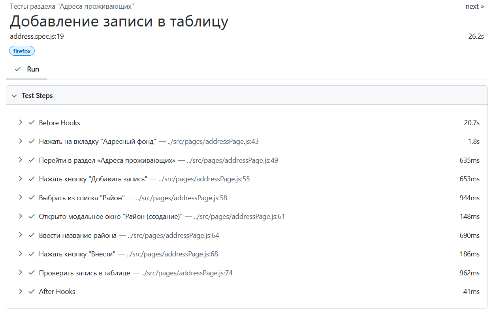
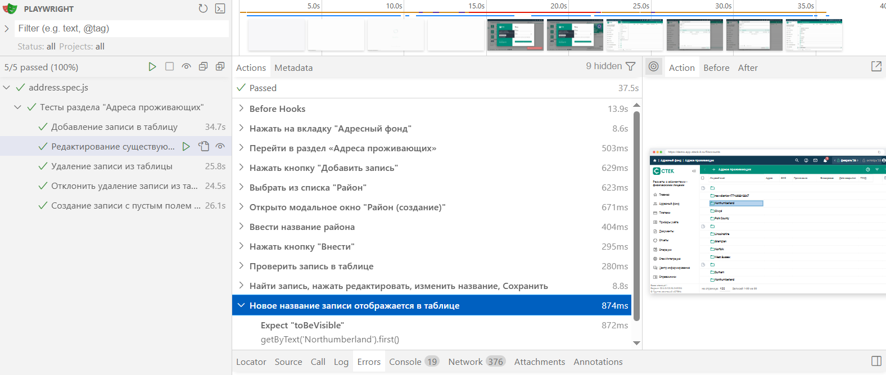

# Отчёт о проведённом тестировании
### Краткое описание
В рамках тестового задания было разработано 5 автотестов. Каждый тест содержит step (шаги), что позволяет человеку, даже не знакомому с кодом, понимать логику проверок. Все автотесты полностью соответствуют требованиям из ТЗ.

При разработке автотестов были использованы различные паттерны для упрощения поддержки и дальнейшего расширения, такие как:

 - Page Object Model - для инкапсуляции логики взаимодействия со страницами.

 - Builder pattern - для удобной генерации тестовых данных.

### Количество тест-кейсов
Общее количество тест-кейсов - 5:

*Позитивные:*
 - Добавление записи в таблицу;
 - Редактирование записи;
 - Удаление записи из таблицы;
 - Отклонение удаления записи из таблицы.

*Негативные:*
 - Создание записи с пустым полем "Название".

Процент успешных тестов - 100%.

**Результат тестов в стандартном отчете** 

**Автотест с понятными шагами**

**Результат тестов в UI интерфейсе**

